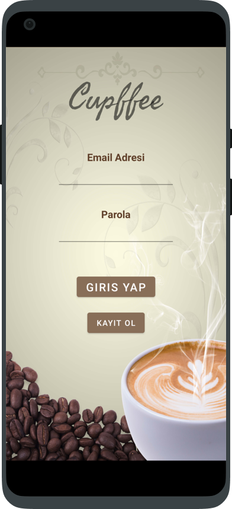
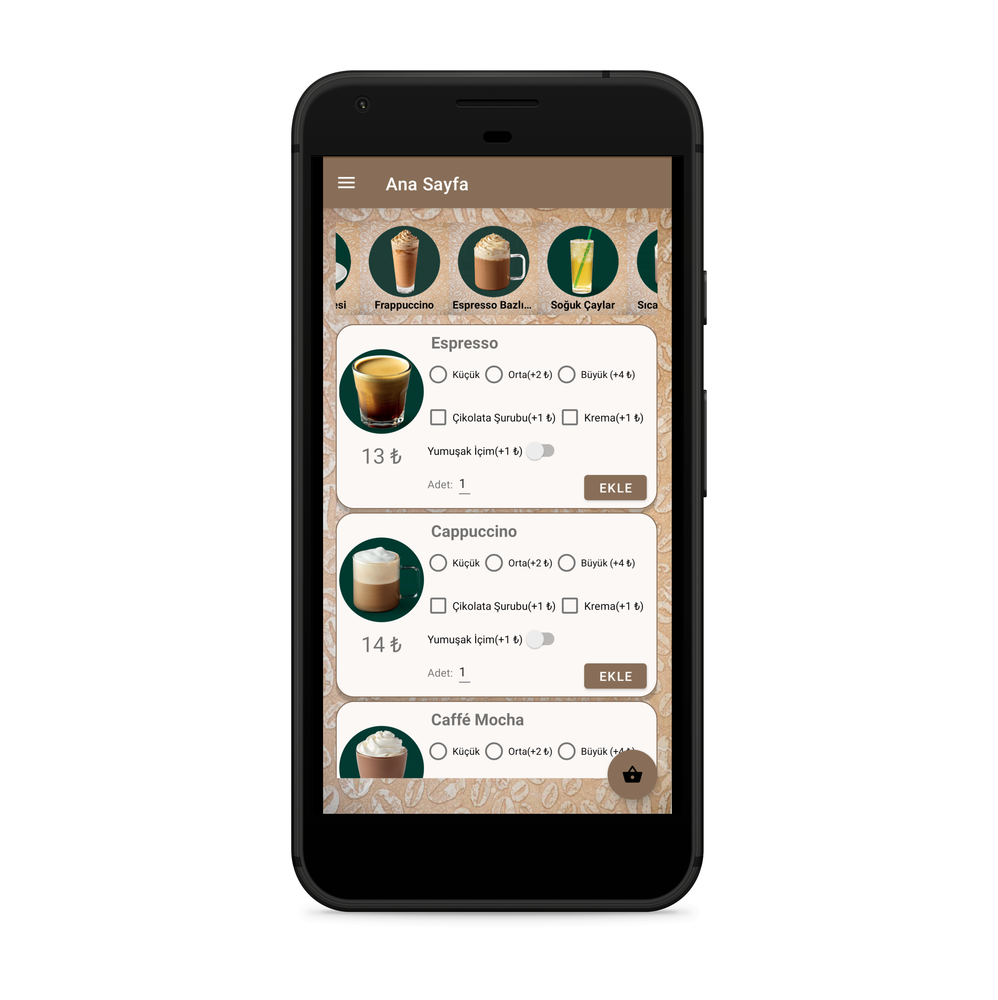
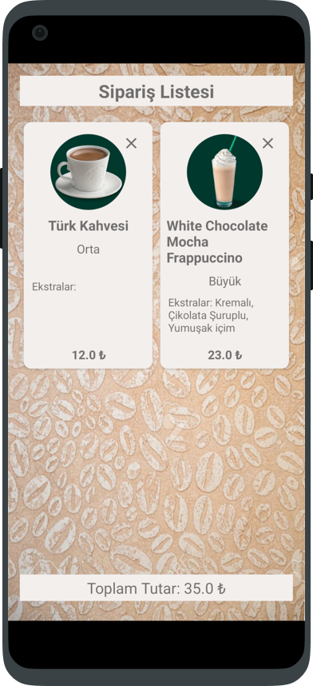
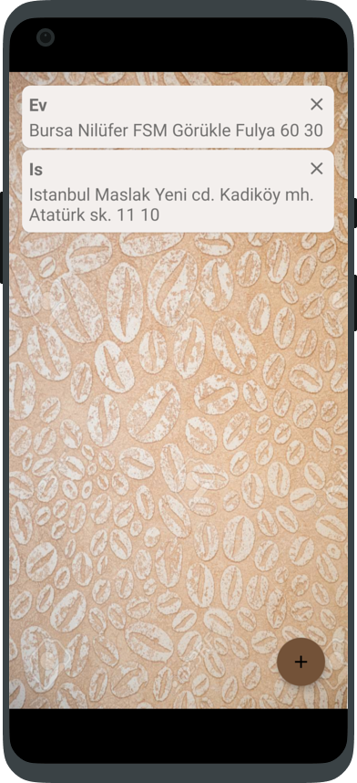

# Cupffee

## About

This app made for see the coffees and their categories from the phone and to order coffees.
You can select coffee size and other coffee extras.

## App Installation For Run The Project

<a href="https://drive.google.com/file/d/1wmmZ91s6t94WYZFBOGtKo9lNc3lnpwm-/view?usp=sharing"> APK </a>

## Technologies

This app made by Android Studio and the language we use is Kotlin. For database we use Google Firebase

<a href="https://kotlinlang.org/"> More info about Kotlin </a>

<a href="https://developer.android.com/studio"> More info about Android Studio </a>

<a href="https://firebase.google.com/"> More info about Google Firebase </a>

## Architecture

We use MVVM (Model-View-Viewmodel) Architecture in this app. Because MVVM cleanly separates the user interface from the application logic. Divorcing one from the other improves application maintenance. It also makes application evolution easier, thereby reducing the risk of technological obsolescence.

<a href="https://en.wikipedia.org/wiki/Model%E2%80%93view%E2%80%93viewmodel"> What is MVVM </a>

Also we use Observer Design Pattern. Because our app has calculation and adding to cart operations. We want our app to have interactive and react quickly. So Observer Design Pattern is what we need.

The Observer Design Pattern is a software design pattern in which an object (called the subject) maintains a list of its dependents (called observers) and notifies them automatically of any state changes, usually by calling one of their methods.

<a href="https://en.wikipedia.org/wiki/Observer_pattern"> Learn more about Observer Design Pattern </a>

## Screenshots

         

## Author

Berkhan Özen

Ahmet Selim Öztürk

Thanks to Yasin Çetin for help this project.
